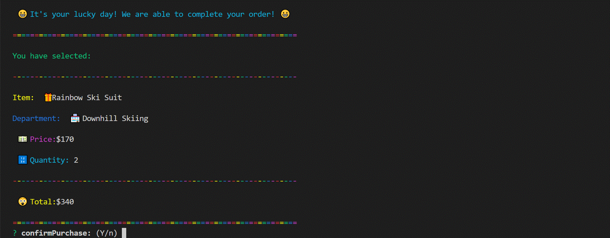

# bamazon

# Node.js & MySQL

Overview

In this activity, we created an Amazon-like storefront with the MySQL skills from this unit. The app takes in orders from customers and deplete stock from the store's inventory.  This funtionality of this program is dependant on the following npm packages: inquire, mysql, cli-table, color and emojis.

**Here is an example of how this interface is used**

 
To start, the user is asked if they would like to view the store inventory.  If they answer "No" 👎, a message is displayed encouraging them to come again soon.
 

 
In this case, the user answers "yes" 👍 and the inventory is shown.  In most cases the view in the console must be full-size to make the table appear as intended.
 

 
At this point, the user is asked if they would like to purchase a particular item 🛒.  If they decided not to purchase the message to come back soon is displayed.
 

 
In this scenario, the user does want to purchase several one-piece rainbow ski suits; however, there are not enough in the store inventory. 😬 Who knew that one-peice rainbow ski suits were the hot item this holiday season! 🤷  The user will have to start over.
 

 
In this scenario, the user realizes that there are only two in stock and orders both of them 😁.
 

 
Next, the cart total is displayed.  The user panics about spending over $300- 😲 on the awesome ski outfits and leaves the shopping interface.
 

 
The user can't get the rainbow one-piece ski suit out of their head and goes back.  Closes their eyes 🙈 and just confirms the purchase, worrying about the price when the credit card statement arrives 🤑.
 

 
The inventory for the ski suits is now set to zero, but the user is obsessed 🙃 and will check back often to see if anymore of these items are in stock.  

Scott Paylor aka Santa 🎅🏻 if you searched through my github repo like I told you earlier I wouldn't mind any of these gifts this year.  Well the rainbow ski suit ⛷️🦄🌈 is kind of a joke but would totally embarrass the kids so I wouldn't complain too much. Winter is coming.  Everything in my "store" will keep me warm and there is even a gift option under $50.  ❄️BRRRR❄️.  Except the lily pad.  We NEED that for 🐻Bear Lake🚤.  And I could live off of cotton candy.

Final note: the "colors" node package works on all terminals I tested.  "Emojis" is a bit trickier.  I was only able to get these to work on the VSC console tests.  For some reason my gitbash is missing an extenstion to read the emojis.  Bu that problem is outside the scope of this class 😆 and I should really focus on something on more imporant things 🤣.